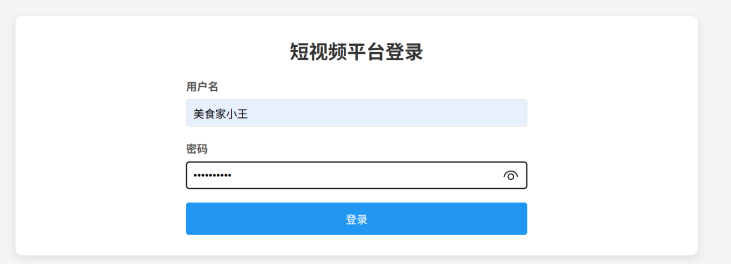
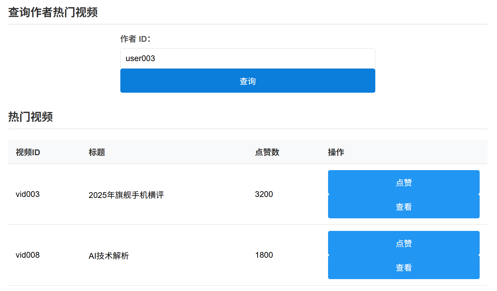
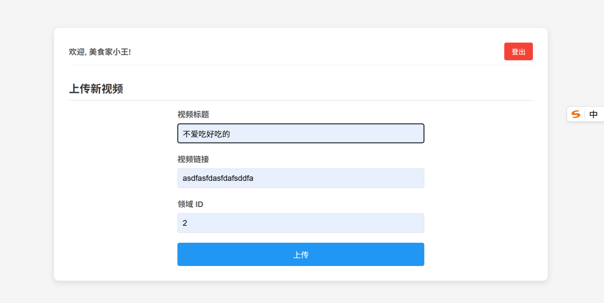
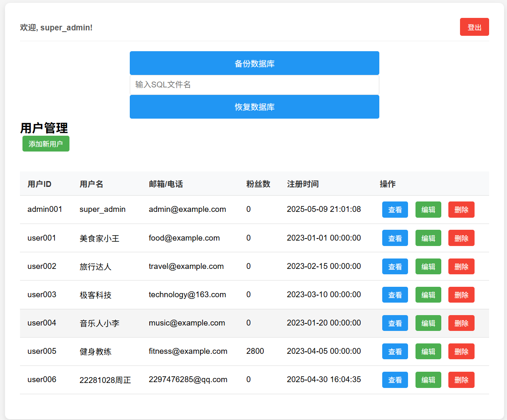

# Short Video Platform

[](https://github.com/Danielz-z/Short-video-platform/actions/workflows/ci.yml)

An engineering-style Flask + MySQL short video platform database system. This project was upgraded from a database course design into a portfolio-ready backend project with normalized relational modeling, layered Flask architecture, role-based administration, security cleanup, and repeatable database performance experiments.

## Project Value

This project focuses on the database and backend engineering behind a short video platform:

- Models core short-video business entities such as users, videos, likes, comments, follows, messages, tags, and content fields.
- Uses MySQL constraints, indexes, and stored procedures to protect data consistency and support common access paths.
- Refactors a course-style single-file Flask app into a maintainable `routes / services / dao` structure.
- Adds security and reliability improvements including password hashing, environment-based configuration, UUID primary keys, role-based admin access, and POST-based destructive actions.
- Provides concurrent benchmark scripts and log summarization tools for index experiment analysis.

## Tech Stack

| Area | Technology |
| --- | --- |
| Backend | Python, Flask, Jinja2 |
| Database | MySQL 8.x, InnoDB, stored procedures, indexes |
| Data Access | mysql-connector-python, DAO layer |
| Security | Werkzeug password hashing, environment variables, role-based access control |
| Testing | unittest, unittest.mock |
| CI | GitHub Actions |
| Experiment | Python threading, CSV logs, pandas, matplotlib |
| Deployment | Docker, Docker Compose |

## Engineering Highlights

| Highlight | Implementation |
| --- | --- |
| Layered backend | `routes` handle HTTP/templates, `services` handle business rules, `dao` handles SQL and stored procedures |
| Relational modeling | 9 business tables with primary keys, foreign keys, unique constraints, and CHECK constraints |
| Role authorization | `users.role` controls admin access instead of username conventions |
| Password security | New passwords are hashed; legacy plaintext passwords are upgraded after successful login |
| Concurrency safety | UUID video/user IDs avoid count-based ID collisions; likes use a unique `(user_id, video_id)` constraint |
| Query optimization | Secondary and composite indexes support author pages, category filtering, timelines, and hot-video rankings |
| Performance experiments | Insert/query/mixed benchmark scripts report QPS, average latency, and P95 latency |
| Testability | Service-layer unit tests cover password policy, role authorization, user creation, and ownership checks |
| Continuous integration | GitHub Actions runs unit tests and Python syntax checks on pushes and pull requests |
| One-command startup | Docker Compose starts Flask and MySQL, then initializes schema, indexes, procedures, and seed data |

## Features

- User login and role-based admin-managed user registration
- User profile viewing, editing, and deletion
- Video upload, listing, detail view, title update, and deletion
- Like records with duplicate-like protection
- Database backup and restore entry points
- MySQL schema, index, procedure, and seed scripts
- Concurrent insert/query benchmark scripts with QPS, average latency, and P95 latency output
- Unit tests for password validation, role authorization, and video ownership checks
- Docker Compose local environment for one-command Flask + MySQL startup

## Project Diagrams

### System Architecture

<p align="center">
  
</p>

The architecture diagram shows the layered Flask backend, MySQL data model, database scripts, and the independent performance experiment workflow.

### Database Performance Experiment

<p align="center">
  
</p>

The performance diagram summarizes the intended comparison format for index experiments: query latency and QPS before and after adding indexes.

## Application Screenshots

The following screenshots come from the original course project documentation and show the main user-facing workflows.

| Login | Video Dashboard |
| --- | --- |
|  |  |

| Upload Video | Admin Dashboard |
| --- | --- |
|  |  |

## Architecture

```text
backend/
  app.py              # Flask application entry point
  config.py           # Environment-based configuration
  routes/             # HTTP and template layer
  services/           # Business rules
  dao/                # SQL and stored procedure access
  utils/db.py         # MySQL connection helper
database/             # Schema, indexes, procedures, seed data, backups
experiments/          # Insert/query/concurrent performance experiments
docs/                 # Design and performance analysis documents
```

## Database Design

Core tables:

- `users`: user accounts with UUID primary keys, hashed passwords, and role-based access control
- `videos`: video metadata linked to authors and content fields
- `likes`: like events with a unique `(user_id, video_id)` constraint
- `comments`: comment records linked to users and videos

Supporting tables include `fields`, `tags`, `video_tags`, `follows`, and `messages` to preserve the original platform features.

## Route Reference

See [docs/api.md](docs/api.md) for the Flask route reference, route-layer mapping, and benchmark command entry points.

## Resume and Interview Notes

- Chinese resume packaging: [docs/resume_zh.md](docs/resume_zh.md)
- English resume packaging: [docs/resume.md](docs/resume.md)
- Interview talking points: [docs/interview_guide_zh.md](docs/interview_guide_zh.md)

## Performance Optimization

The key indexes are defined in `database/indexes.sql`:

```sql
CREATE INDEX idx_videos_author_id ON videos(author_id);
CREATE INDEX idx_videos_field_id ON videos(field_id);
CREATE INDEX idx_videos_upload_time ON videos(upload_time);
```

These indexes optimize author pages, category filtering, timeline ordering, and hot-video queries. The experiment system is designed for before/after comparisons with and without secondary indexes.

## Experiment Output

Benchmark scripts print:

- total operations
- elapsed time
- average latency
- P95 latency
- QPS

Logs are written to `experiments/logs`. Charts can be generated with `experiments/analysis/draw_pictures.py`. Markdown summaries can be generated with `experiments/analysis/summarize_logs.py`. See `docs/performance_analysis.md` and `docs/performance_results.md` for the experiment plan and result-recording workflow.

## Quick Start

### Docker Compose

Start the Flask app and MySQL database:

```bash
docker compose up --build
```

Open the app:

```text
http://localhost:5000
```

Demo accounts:

| Role | Username | Password |
| --- | --- | --- |
| Admin | `admin_demo` | `DemoPass123` |
| User | `food_creator` | `DemoPass123` |
| User | `tech_creator` | `DemoPass123` |

The MySQL container initializes the database with:

1. `database/schema.sql`
2. `database/indexes.sql`
3. `database/procedures.sql`
4. `database/seed.sql`

To reset the Docker database volume and re-run initialization:

```bash
docker compose down -v
docker compose up --build
```

### Manual Setup

Install dependencies:

```bash
pip install -r requirements.txt
```

Create environment variables. On Windows PowerShell:

```powershell
$env:DB_HOST="localhost"
$env:DB_USER="root"
$env:DB_PASSWORD="your_password"
$env:DB_NAME="short_video_platform"
$env:SECRET_KEY="change-me"
```

You can use `.env.example` as the reference for required local configuration values.

Initialize MySQL:

```bash
mysql -u root -p < database/schema.sql
mysql -u root -p < database/indexes.sql
mysql -u root -p < database/procedures.sql
mysql -u root -p < database/seed.sql
```

If you are upgrading an existing local database created before role-based access control was added, run:

```bash
mysql -u root -p < database/migrations/001_add_user_roles.sql
```

The demo seed users use `DemoPass123` as the password. Change or remove these users before any real deployment.

Run the web app:

```bash
python backend/app.py
```

Run a mixed benchmark:

```bash
python experiments/run_parallel.py --threads 8 --batch-size 500 --duration 300 --author-id 33333333-3333-3333-3333-333333333333
```

Summarize benchmark logs:

```bash
python experiments/analysis/summarize_logs.py experiments/logs/query_no_index.csv experiments/logs/query_with_index.csv
```

Run tests:

```bash
python -m unittest discover -s tests
```

Expected test result:

```text
Ran 8 tests
OK
```

## Security Notes

- Do not commit `.env` files or real database backups.
- Set a strong `SECRET_KEY` before deployment.
- Store database credentials in environment variables only.
- Admin permissions are checked through the `users.role` column instead of username conventions.
- Replace demo seed passwords before using seed accounts in a real environment.
