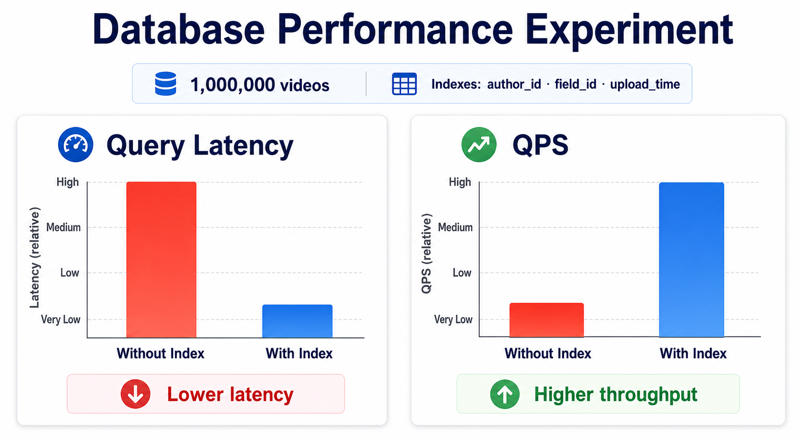

# Database Performance Analysis



## 1. Experiment Environment

- Backend: Flask + mysql-connector-python
- Database: MySQL 8.x / InnoDB
- Character set: utf8mb4
- Scripts: `experiments/insert`, `experiments/query`
- Metrics: average latency, QPS, P95 latency, and total operations

## 2. Data Scale

The target scale is 1,000,000 rows in the `videos` table. Insert workers use concurrent batch inserts to create enough rows for meaningful index experiments.

## 3. Experiment Method

Insert benchmark:

```bash
python experiments/insert/insert_worker.py --threads 8 --batch-size 500 --duration 300 --author-id 33333333-3333-3333-3333-333333333333
```

Query benchmark:

```bash
python experiments/query/query_worker.py --threads 8 --duration 300 --field-id 3
```

Mixed workload benchmark:

```bash
python experiments/run_parallel.py --threads 8 --batch-size 500 --duration 300 --author-id 33333333-3333-3333-3333-333333333333
```

## 4. Control Groups

Without indexes: initialize the schema and skip `database/indexes.sql`, keeping only primary keys and unique constraints.

With indexes: apply `database/indexes.sql`, especially:

- `CREATE INDEX idx_videos_author_id ON videos(author_id);`
- `CREATE INDEX idx_videos_field_id ON videos(field_id);`
- `CREATE INDEX idx_videos_upload_time ON videos(upload_time);`

## 5. Result Analysis

For `WHERE field_id = ?`, the no-index group requires a large scan as the `videos` table grows. At the million-row scale, average latency and P95 latency are expected to increase significantly.

After adding `idx_videos_field_id`, MySQL can locate matching rows through a secondary index. Query latency should drop and QPS should improve.

Insert throughput may be lower in the indexed group because each insert must maintain additional secondary indexes. This is the core tradeoff: read-heavy workloads benefit from carefully chosen indexes, while write-heavy workloads require a controlled index set.

## 6. Conclusion

For this short video platform, author pages, field/category pages, timelines, and hot-video lists are core read paths. Indexes on `author_id`, `field_id`, `upload_time`, and hot-ranking combinations are justified.

The experiment system demonstrates that database optimization should be driven by measured access patterns rather than by adding indexes blindly.

For the repeatable result-recording workflow and table template, see [performance_results.md](performance_results.md).
