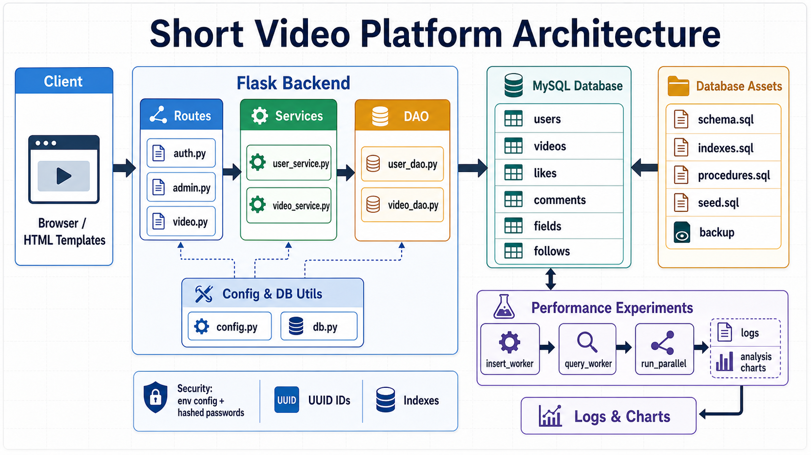

# System Design

## 1. Design Goals

The project was refactored from a single-file Flask application into a layered backend:

- `routes`: HTTP requests, forms, page rendering, redirects, and flash messages
- `services`: authentication, password policy, permission checks, and video business rules
- `dao`: SQL statements and stored procedure calls
- `utils/db.py`: shared MySQL connection pool helper
- `experiments`: isolated database performance experiments outside the web application

## 2. Core Modules

The user module handles login, role-based admin-managed registration, paginated user listing, profile editing, user deletion, and user detail views. Passwords are stored with Werkzeug hashes. Legacy plain-text passwords are accepted once and upgraded to hashes after successful login.

The video module handles paginated video listing, upload, title updates, deletion, likes, and detail views. `user_id` and `video_id` use UUIDs, removing the concurrency risk caused by `COUNT(*)`-based ID generation.

The admin module handles user management and database backup/restore. Admin access is checked through the `users.role` field rather than username conventions. Database host, user, password, and database name are loaded from environment variables instead of source code.

Database access uses a lazily initialized MySQL connection pool. Flask request handlers borrow pooled connections through `get_db_connection()` and return them with `close()`, reducing repeated connection setup overhead.

## 3. Database Design

The core data model contains `users`, `videos`, `likes`, and `comments`. The schema also keeps `fields`, `tags`, `video_tags`, `follows`, and `messages` to preserve the original feature surface.

High-frequency access paths:

- author video list: `videos.author_id`
- field/category filtering: `videos.field_id`
- timeline ordering: `videos.upload_time`
- hot videos by author: `videos(author_id, likes_count, upload_time)`

List pages use `COUNT(*)` plus `LIMIT/OFFSET` pagination so user and video dashboards do not load every matching row at once as data grows.

## 4. Security Design

- Database configuration is injected with `DB_HOST`, `DB_USER`, `DB_PASSWORD`, and `DB_NAME`.
- New passwords are hashed before storage.
- Admin permissions are role-based through `users.role = 'admin'`.
- User deletion is handled through a POST form and blocks deletion of the currently signed-in admin account.
- Backup and restore commands use `MYSQL_PWD` in the child process environment instead of command-line `-pPASSWORD`.
- Video update and deletion require the current user to be the video author.
- `.env`, backup SQL files, generated benchmark logs, and generated charts are ignored by Git.
